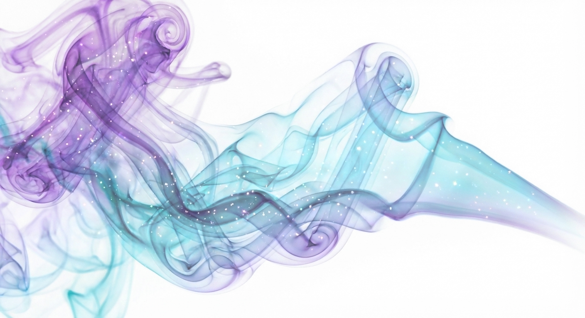

# terminal-banana

CLI tool for AI image generation using Nano Banana (Gemini Image) APIs.

> **Tip:** Use `tbanana` as a shorter alias for `terminal-banana`

## Examples

| Icon Generation | Transparent Smoke (with alpha channel) |
|-----------------|----------------------------------------|
|  |  |
| `tbanana icon -o ./out "a banana"` | `tbanana transparent -o ./out "ethereal smoke wisps"` |

## Features

- **Image Generation** - Generate images, icons, logos, and UI concepts
- **Image Editing** - Edit existing images with text prompts
- **Transparent Images** - Generate or extract images with alpha channels using difference matting
- **Reference Images** - Use up to 14 reference images to guide generation
- **Resolution Control** - Generate up to 4K images (pro model)
- **Aspect Ratio Control** - Support for various aspect ratios

## Installation

### Prerequisites

- Node.js 18+
- A Gemini API key from [Google AI Studio](https://aistudio.google.com/apikey)

### Install from source

```bash
# Clone the repository
git clone https://github.com/ETM-Code/terminal-banana.git
cd terminal-banana

# Install dependencies
npm install

# Build
npm run build

# Link globally
npm link
```

### Configure API key

```bash
terminal-banana config set-key
# Enter your Gemini API key when prompted
```

## Usage

### Generate Images

```bash
# Basic image generation
terminal-banana generate -o ./output "a cyberpunk cityscape at night"

# Generate a minimalist icon
terminal-banana icon -o ./icons "a home button"

# Generate a logo
terminal-banana logo -o ./logos "TechCorp, modern minimalist"

# Generate a UI concept
terminal-banana ui -o ./mockups "dashboard with analytics charts"
```

### Edit Images

```bash
# Edit an existing image
terminal-banana edit -o ./edited -i ./photo.png "add a sunset in the background"
```

### Generate with Transparency

Uses the difference matting technique to generate images with proper alpha channels:

```bash
# Generate transparent image (default: pro-pro method)
terminal-banana transparent -o ./assets "a glass orb with reflections"

# Generate transparent icon
terminal-banana transparent-icon -o ./icons "a settings gear"

# Specify method for speed/quality tradeoff
terminal-banana transparent -o ./assets "smoke effect" --method flash-flash
```

### Remove Background from Existing Images

```bash
# Remove background (pro-pro for best quality)
terminal-banana edit-transparent -o ./transparent -i ./logo.png --method pro-pro

# Faster background removal (flash-flash)
terminal-banana edit-transparent -o ./transparent -i ./photo.png --method flash-flash
```

### Reference Images

Use existing images to guide generation:

```bash
# Single reference
terminal-banana generate -o ./output -r ./style-ref.png "a portrait in this style"

# Multiple references (up to 14 for pro model)
terminal-banana generate -o ./output -r ./person1.png -r ./person2.png "group photo of these people"
```

### Resolution and Aspect Ratio

```bash
# High resolution (pro model only)
terminal-banana generate -o ./output --resolution 2K "detailed landscape"

# Custom aspect ratio
terminal-banana generate -o ./output --aspect-ratio 16:9 "cinematic scene"

# Combined
terminal-banana generate -o ./output --resolution 4K --aspect-ratio 21:9 "epic panorama"
```

## Options

| Option | Description |
|--------|-------------|
| `-o <dir>` | Output directory (required) |
| `-i <image>` | Input image for editing |
| `-r <image>` | Reference image (repeatable, up to 14) |
| `--model <m>` | Model: `nano-banana-pro` (default), `nano-banana` |
| `--method <m>` | Transparency method: `pro-pro`, `pro-flash`, `flash-flash` |
| `--resolution <r>` | Image size: `1K` (default), `2K`, `4K` (pro only) |
| `--aspect-ratio <ar>` | Aspect ratio: `1:1`, `16:9`, `9:16`, `4:3`, `3:4`, etc. |
| `--name <filename>` | Custom output filename (without extension) |
| `--open` | Open generated image in default viewer |
| `--cost` | Show estimated cost and confirm before generating |

## Models

| Model | API Name | Best For |
|-------|----------|----------|
| `nano-banana` | gemini-2.5-flash-image | Fast generation, simple images |
| `nano-banana-pro` | gemini-3-pro-image-preview | Complex images, precise text, diagrams |

## Transparency Methods

### API Methods (difference matting)
Uses AI to generate white/black background versions, then calculates transparency:

| Method | Generation | Editing | Quality | Speed | Cost |
|--------|------------|---------|---------|-------|------|
| `pro-pro` | Pro | Pro | Best | Slowest | $$$ |
| `pro-flash` | Pro | Flash | Good | Medium | $$ |
| `flash-flash` | Flash | Flash | Adequate | Fast | $ |

### Local Method (no API calls)
Simple color-based removal - **free** but only works well for solid color backgrounds:

```bash
# Auto-detect background color from corners
terminal-banana edit-transparent -o ./out -i ./image.png --method local

# Specify background color
terminal-banana edit-transparent -o ./out -i ./image.png --method local --bg-color white
terminal-banana edit-transparent -o ./out -i ./image.png --method local --bg-color "#00ff00"

# Adjust tolerance (0-255, default 30)
terminal-banana edit-transparent -o ./out -i ./image.png --method local --tolerance 50
```

**When to use local:** Simple solid backgrounds (white, black, green screen)
**When to use API:** Complex backgrounds, gradients, shadows, fine edges

## Config Commands

```bash
terminal-banana config set-key    # Set API key (hidden input)
terminal-banana config show       # Show config (key masked)
terminal-banana config clear      # Remove API key
terminal-banana config path       # Show config file location
```

Config is stored at `~/.config/terminal-banana/config.json`

## Output Format

All commands output JSON for easy parsing:

```json
{
  "path": "/absolute/path/to/image.png",
  "model": "nano-banana-pro",
  "prompt": "the processed prompt"
}
```

## License

MIT
